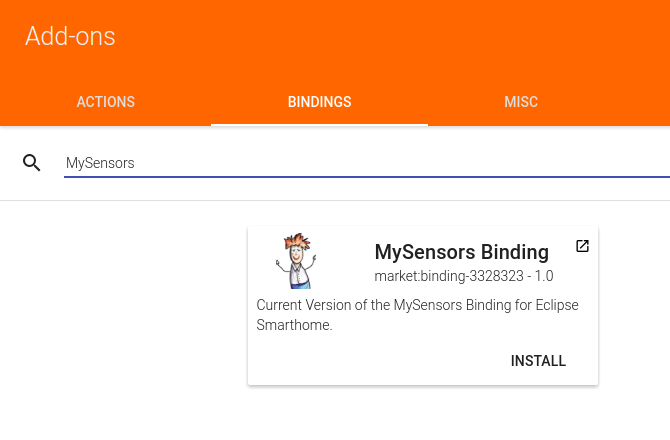
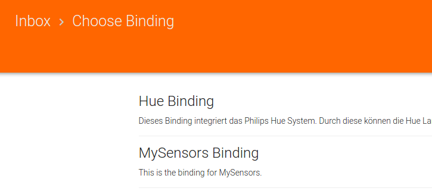

# MySensors & openHAB 2.3

openHAB 2.3 seem to has an official binding for [MySensors](https://www.mysensors.org/).

Sources:
* https://forum.mysensors.org/topic/7176/openhab-2-2-binding/
* https://github.com/openhab/openhab2-addons/pull/2066


For this reason we will install it fully manual or semi manual via the Eclipse IoT Marketplace.
In both cases we're facing the drawback of [installing the dependencies manually](https://forum.mysensors.org/topic/7176/openhab-2-2-binding/8).

Note: Beware of that the Marketplace-approach has the advantage of getting the latest version of the MySensors-Binding. In the fully manual approach you have to choose a version on your own. 


#### 0. Start openHAB-console
```bash
$ sudo openhab-cli start
```

#### 1. MySensors required features
This step is really important. Don't skip it!
When you not doing this it seems the binding is installed successful but it isn't!!

##### Install
Source: [Link](https://github.com/tobof/openhab2-addons/wiki/Installation)

```bash
$ feature:install openhab-transport-serial
$ feature:install esh-io-transport-mqtt
```
##### Verify
```bash
$ feature:info openhab-transport-serial 
$ feature:info esh-io-transport-mqtt
```

#### 2. MySensors itself

##### A. Via Eclipse IoT Marketplace
###### 1. Install Eclipse IoT Marketplace
```bash
$ feature:install openhab-misc-market
$ feature:info openhab-misc-market
```
###### 2. Install MySensor via PaperUI


##### B. Manually
###### Install
```bash
$ bundle:install http://www.oberfoell.com/openhab2/org.openhab.binding.mysensors-2.4.0-SNAPSHOT.jar
```
###### Start
```bash
$ bundle:start BUNDLE_ID_FROM_STEP_BEFORE
```
##### Verify Installation
```bash
$ bundle:list | grep MySensors 
```

#### Overall Test
When you see the following entry while adding a new thing you're really got it :)


